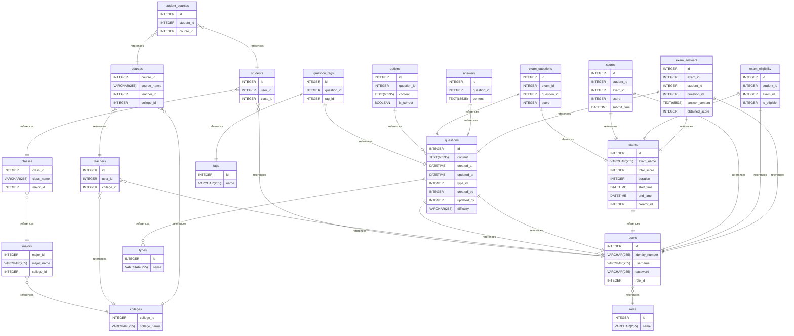

# 基于 vue3/swing + SpringBoot 的前后端分离的考试系统

## 需求分析

- 管理员

  - 用户管理

    - 教师账号管理（增删改查）
    - 学生账号管理（批量导入/导出）

  - 组织管理
    - 学院/专业/班级管理

- 教师

  - 学生管理
    - 分组管理
    - 学生信息修改
  - 课程管理
    - 课程信息管理
    - 对应学生管理
  - 题目管理
    - 录入题目(单选、多选、判断、填空)
    - 题目难度管理
    - 题目分组
    - 题库导入/导出
    - 题目使用统计与分析
  - 试卷管理
    - 试卷创建(手动/自动选题)修改、删除
    - 考试时间设置
  - 成绩管理
    - 成绩手动录入（非在线考试）
    - 成绩批量导入/导出
    - 成绩分析报表生成
    - 成绩导出
  - 资格管理
    - 管理学生考试资格
  - 个人管理
    - 修改个人信息
    - 修改密码

- 学生
  - 考试
  - 个人管理
    - 修改个人信息
    - 修改密码
  - 成绩查询

## 设计数据库表

# Untitled Diagram documentation

# Untitled Diagram documentation

## Summary

- [基于 vue3/swing + SpringBoot 的前后端分离的考试系统](#基于-vue3swing--springboot-的前后端分离的考试系统)
	- [需求分析](#需求分析)
	- [设计数据库表](#设计数据库表)
- [Untitled Diagram documentation](#untitled-diagram-documentation)
- [Untitled Diagram documentation](#untitled-diagram-documentation-1)
	- [Summary](#summary)
	- [Introduction](#introduction)
	- [Database type](#database-type)
	- [Table structure](#table-structure)
		- [majors](#majors)
		- [classes](#classes)
		- [colleges](#colleges)
		- [roles](#roles)
		- [users](#users)
		- [students](#students)
		- [teachers](#teachers)
		- [courses](#courses)
		- [student\_courses](#student_courses)
		- [questions](#questions)
		- [tags](#tags)
		- [question\_tags](#question_tags)
		- [types](#types)
		- [options](#options)
		- [answers](#answers)
		- [exams](#exams)
		- [exam\_questions](#exam_questions)
		- [scores](#scores)
		- [exam\_eligibility](#exam_eligibility)
		- [exam\_answers](#exam_answers)
	- [Relationships](#relationships)
	- [Database Diagram](#database-diagram)

## Introduction

## Database type

- **Database system:** MySQL

## Table structure

### majors

| Name           | Type         | Settings                       | References                    | Note |
| -------------- | ------------ | ------------------------------ | ----------------------------- | ---- |
| **major_id**   | INTEGER      | 🔑 PK, not null, autoincrement |                               |      |
| **major_name** | VARCHAR(255) | not null                       |                               |      |
| **college_id** | INTEGER      | not null                       | fk_majors_college_id_colleges |      |

### classes

| Name           | Type         | Settings                       | References                 | Note |
| -------------- | ------------ | ------------------------------ | -------------------------- | ---- |
| **class_id**   | INTEGER      | 🔑 PK, not null, autoincrement |                            |      |
| **class_name** | VARCHAR(255) | not null                       |                            |      |
| **major_id**   | INTEGER      | not null                       | fk_classes_major_id_majors |      |

### colleges

| Name             | Type         | Settings                       | References | Note |
| ---------------- | ------------ | ------------------------------ | ---------- | ---- |
| **college_id**   | INTEGER      | 🔑 PK, not null, autoincrement |            |      |
| **college_name** | VARCHAR(255) | not null                       |            |      |

### roles

| Name     | Type         | Settings                       | References | Note |
| -------- | ------------ | ------------------------------ | ---------- | ---- |
| **id**   | INTEGER      | 🔑 PK, not null, autoincrement |            |      |
| **name** | VARCHAR(255) | not null                       |            |      |

### users

| Name                | Type         | Settings                       | References             | Note |
| ------------------- | ------------ | ------------------------------ | ---------------------- | ---- |
| **id**              | INTEGER      | 🔑 PK, not null, autoincrement |                        |      |
| **identity_number** | VARCHAR(255) | not null, unique               |                        |      |
| **username**        | VARCHAR(255) | not null                       |                        |      |
| **password**        | VARCHAR(255) | not null                       |                        |      |
| **role_id**         | INTEGER      | not null                       | fk_users_role_id_roles |      |

### students

| Name         | Type    | Settings                       | References                   | Note |
| ------------ | ------- | ------------------------------ | ---------------------------- | ---- |
| **id**       | INTEGER | 🔑 PK, not null, autoincrement |                              |      |
| **user_id**  | INTEGER | not null                       | fk_students_user_id_users    |      |
| **class_id** | INTEGER | not null                       | fk_students_class_id_classes |      |

### teachers

| Name           | Type    | Settings                       | References                      | Note |
| -------------- | ------- | ------------------------------ | ------------------------------- | ---- |
| **id**         | INTEGER | 🔑 PK, not null, autoincrement |                                 |      |
| **user_id**    | INTEGER | not null                       | fk_teachers_user_id_users       |      |
| **college_id** | INTEGER | not null                       | fk_teachers_college_id_colleges |      |

### courses

| Name            | Type         | Settings                       | References                     | Note |
| --------------- | ------------ | ------------------------------ | ------------------------------ | ---- |
| **course_id**   | INTEGER      | 🔑 PK, not null, autoincrement |                                |      |
| **course_name** | VARCHAR(255) | null                           |                                |      |
| **teacher_id**  | INTEGER      | null                           | fk_courses_teacher_id_teachers |      |
| **college_id**  | INTEGER      | null                           | fk_courses_college_id_colleges |      |

### student_courses

| Name           | Type    | Settings                       | References                             | Note |
| -------------- | ------- | ------------------------------ | -------------------------------------- | ---- |
| **id**         | INTEGER | 🔑 PK, not null, autoincrement |                                        |      |
| **student_id** | INTEGER | not null                       | fk_student_courses_student_id_students |      |
| **course_id**  | INTEGER | not null                       | fk_student_courses_course_id_courses   |      |

### questions

| Name           | Type         | Settings                               | References                    | Note           |
| -------------- | ------------ | -------------------------------------- | ----------------------------- | -------------- |
| **id**         | INTEGER      | 🔑 PK, not null, unique, autoincrement |                               |                |
| **content**    | TEXT(65535)  | not null                               |                               |                |
| **created_at** | DATETIME     | not null                               |                               |                |
| **updated_at** | DATETIME     | not null                               |                               |                |
| **type_id**    | INTEGER      | not null                               | fk_questions_type_id_types    |                |
| **created_by** | INTEGER      | not null                               | fk_questions_author_id_users  |                |
| **updated_by** | INTEGER      | null                                   | fk_questions_updated_by_users |                |
| **difficulty** | VARCHAR(255) | null                                   |                               | 简单/中等/困难 |

### tags

| Name     | Type         | Settings                               | References | Note |
| -------- | ------------ | -------------------------------------- | ---------- | ---- |
| **id**   | INTEGER      | 🔑 PK, not null, unique, autoincrement |            |      |
| **name** | VARCHAR(255) | not null                               |            |      |

### question_tags

| Name            | Type    | Settings                               | References                             | Note |
| --------------- | ------- | -------------------------------------- | -------------------------------------- | ---- |
| **id**          | INTEGER | 🔑 PK, not null, unique, autoincrement |                                        |      |
| **question_id** | INTEGER | null                                   | fk_question_tags_qusetion_id_questions |      |
| **tag_id**      | INTEGER | null                                   | fk_question_tags_tag_id_tags           |      |

### types

| Name     | Type         | Settings                               | References | Note |
| -------- | ------------ | -------------------------------------- | ---------- | ---- |
| **id**   | INTEGER      | 🔑 PK, not null, unique, autoincrement |            |      |
| **name** | VARCHAR(255) | not null                               |            |      |

### options

| Name            | Type        | Settings                               | References                       | Note |
| --------------- | ----------- | -------------------------------------- | -------------------------------- | ---- |
| **id**          | INTEGER     | 🔑 PK, not null, unique, autoincrement |                                  |      |
| **question_id** | INTEGER     | not null                               | fk_options_question_id_questions |      |
| **content**     | TEXT(65535) | not null                               |                                  |      |
| **is_correct**  | BOOLEAN     | not null, default: false               |                                  |      |

### answers

| Name            | Type        | Settings                               | References                       | Note |
| --------------- | ----------- | -------------------------------------- | -------------------------------- | ---- |
| **id**          | INTEGER     | 🔑 PK, not null, unique, autoincrement |                                  |      |
| **question_id** | INTEGER     | not null                               | fk_answers_question_id_questions |      |
| **content**     | TEXT(65535) | not null                               |                                  |      |

### exams

| Name            | Type         | Settings                               | References                | Note |
| --------------- | ------------ | -------------------------------------- | ------------------------- | ---- |
| **id**          | INTEGER      | 🔑 PK, not null, unique, autoincrement |                           |      |
| **exam_name**   | VARCHAR(255) | not null                               |                           |      |
| **total_score** | INTEGER      | not null                               |                           |      |
| **duration**    | INTEGER      | null                                   |                           |      |
| **start_time**  | DATETIME     | not null                               |                           |      |
| **end_time**    | DATETIME     | not null                               |                           |      |
| **creator_id**  | INTEGER      | null                                   | fk_exams_creator_id_users |      |

### exam_questions

| Name            | Type    | Settings                               | References                              | Note |
| --------------- | ------- | -------------------------------------- | --------------------------------------- | ---- |
| **id**          | INTEGER | 🔑 PK, not null, unique, autoincrement |                                         |      |
| **exam_id**     | INTEGER | not null                               | fk_exam_questions_exam_id_exams         |      |
| **question_id** | INTEGER | not null                               | fk_exam_questions_question_id_questions |      |
| **score**       | INTEGER | not null                               |                                         |      |

### scores

| Name            | Type     | Settings                               | References                 | Note |
| --------------- | -------- | -------------------------------------- | -------------------------- | ---- |
| **id**          | INTEGER  | 🔑 PK, not null, unique, autoincrement |                            |      |
| **student_id**  | INTEGER  | not null                               | fk_scores_student_id_users |      |
| **exam_id**     | INTEGER  | not null                               | fk_scores_exam_id_exams    |      |
| **score**       | INTEGER  | null                                   |                            |      |
| **submit_time** | DATETIME | null                                   |                            |      |

### exam_eligibility

| Name            | Type    | Settings                               | References                           | Note |
| --------------- | ------- | -------------------------------------- | ------------------------------------ | ---- |
| **id**          | INTEGER | 🔑 PK, not null, unique, autoincrement |                                      |      |
| **student_id**  | INTEGER | not null                               | fk_exam_eligibility_student_id_users |      |
| **exam_id**     | INTEGER | not null                               | fk_exam_eligibility_exam_id_exams    |      |
| **is_eligible** | INTEGER | null, default: tue                     |                                      |      |

### exam_answers

| Name               | Type        | Settings                               | References                            | Note |
| ------------------ | ----------- | -------------------------------------- | ------------------------------------- | ---- |
| **id**             | INTEGER     | 🔑 PK, not null, unique, autoincrement |                                       |      |
| **exam_id**        | INTEGER     | not null                               | fk_exam_answers_exam_id_exams         |      |
| **student_id**     | INTEGER     | not null                               | fk_exam_answers_student_id_users      |      |
| **question_id**    | INTEGER     | not null                               | fk_exam_answers_question_id_questions |      |
| **answer_content** | TEXT(65535) | not null                               |                                       |      |
| **obtained_score** | INTEGER     | not null                               |                                       |      |

## Relationships

- **majors to colleges**: many_to_one
- **classes to majors**: many_to_one
- **users to roles**: many_to_one
- **students to users**: many_to_one
- **teachers to users**: many_to_one
- **courses to teachers**: many_to_one
- **students to classes**: many_to_one
- **student_courses to students**: many_to_one
- **student_courses to courses**: many_to_one
- **teachers to colleges**: many_to_one
- **question_tags to questions**: one_to_one
- **courses to colleges**: many_to_one
- **question_tags to tags**: one_to_one
- **questions to types**: one_to_many
- **options to questions**: one_to_many
- **questions to users**: one_to_many
- **questions to users**: one_to_one
- **exams to users**: one_to_one
- **exam_questions to exams**: one_to_one
- **exam_questions to questions**: one_to_one
- **scores to exams**: one_to_one
- **scores to users**: one_to_one
- **exam_eligibility to users**: one_to_one
- **exam_eligibility to exams**: one_to_one
- **exam_answers to exams**: one_to_one
- **exam_answers to users**: one_to_one
- **answers to questions**: one_to_one
- **exam_answers to questions**: one_to_one

## Database Diagram

